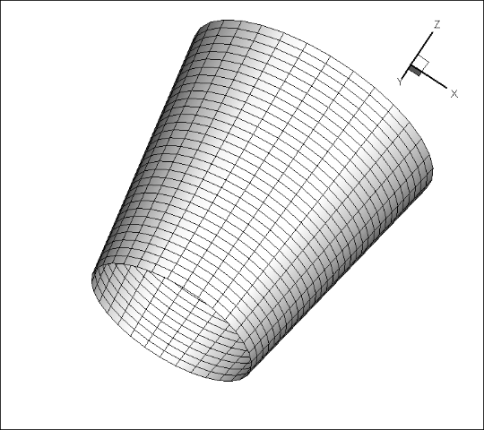

## Моделирование преодоления препятствий судном на воздушной подушке
ПО позволяет моделировать преодоление различных препятствий на ландшафте судном на воздушной подушке. Воздушная подушка -- это упругая плотная камера в виде усечённого конуса, внутри которой нагнетается избыточное давление воздуха. При движении подушки учитывается 5 сил -- давления, трения, тяжести, сопротивления изгибу и растяжения-сжатия. 
#### Описание задачи
- [Физическая постановка задачи](Docs/Физическая%20Постановка.pdf)
- [Mатематическая модель](Docs/Математическая%20модель.pdf)
- [Программная реализация](Docs/Программная%20реализация.pdf)

#### Результаты
Ниже приведен результат моделирования движения воздушной подушки, преодолевающей холмообразное препятствие:

Пример более детализированного моделирования можно посмотреть на Youtube:

###### Проект был выполнен во время моей работы в [МГТУ им. Баумана](https://bmstu.ru/) в 2013 году.
---
## Hovercraft Obstacle Overcoming Simulation
The software allows simulating obstacles navigation by air cushion hovercraft in the landscape. An air cushion is an elastic dense chamber in the form of a truncated cone, inside which excess air pressure is injected. When the air cushion is moving, 5 forces are taken into account - pressure, friction, gravity, resistance to bending and tension-compression.
#### Description of the problem
- [Physical formulation of the problem (RU)](Docs/Физическая%20Постановка.pdf)
- [Mathematical model (RU)](Docs/Математическая%20модель.pdf)
- [Software implementation (RU)](Docs/Программная%20реализация.pdf)

#### Results
Below is the result of modeling the motion of an air cushion overcoming a hillock obstacle:

An example of a more detailed modeling can be viewed on Youtube:

###### The project was completed during my work at [Bauman MSTU](https://www.bmstu.ru/en/) in 2013.
